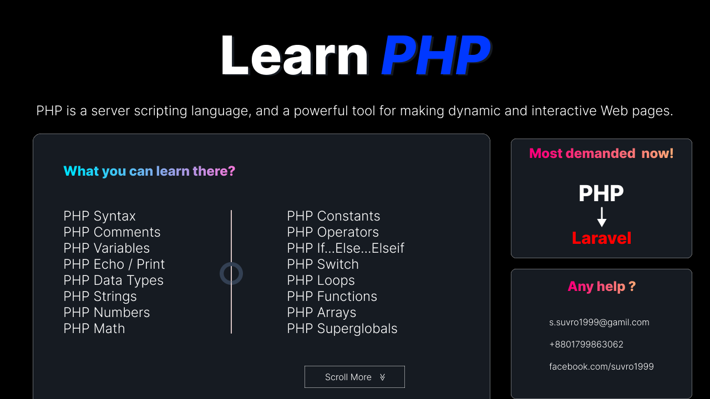

<h1>The decomentation of the repositorie</h>
 

In this repositorie you can find all example of below^ content and you can practices if you think your need those all those example are learn from <a color="red">W3school.com</a>. Happy learning.

<h1 style="justify-content:center; color: pink;">The way of Practice and Learning</h>
 
 
 

  	<ul>
    <li><h3>Learning Process</h3></li>
    <li>If your absolate new than complete the basic sence of codeing.</li>
    <li>Open W3school Go to the PHP tutorial and Start learning.</li>
    <li>You can download my github repositorie code by clicking download zip file.</li>
    <li>You can make your own repositories and upload code.</li>

    </ul>

	

